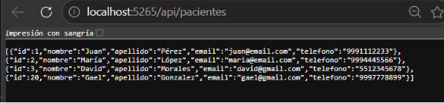
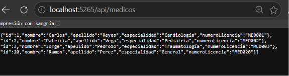
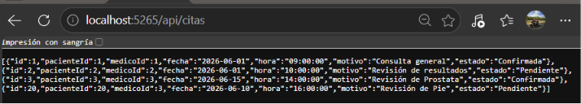
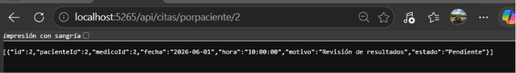
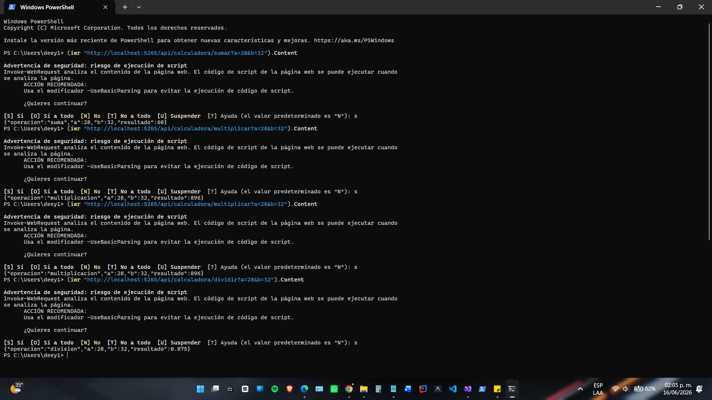
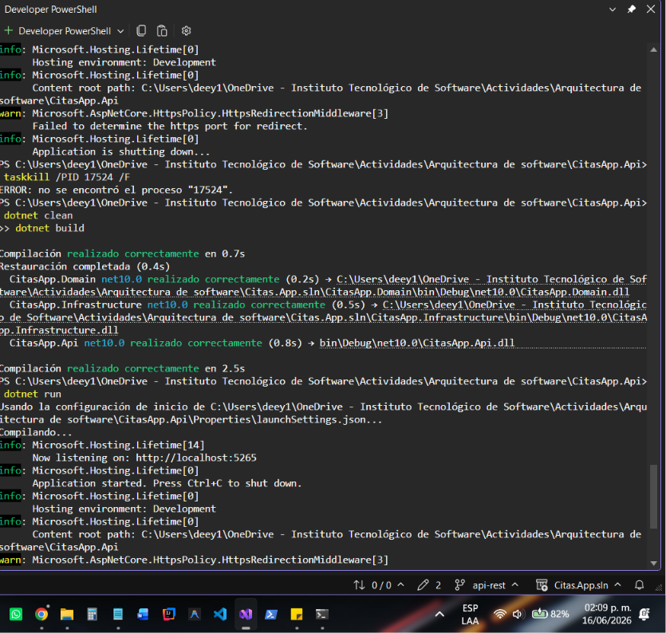

# Documentación API REST – Actividad #24

## Información General

**Materia:** Arquitectura de Software

**Alumno:** David Morales Guerrero

**Proyecto:** CitasApp

**Semana:** 7 - 16/06/2026

**Arquitectura utilizada:** Hexagonal (Ports and Adapters)

---

# Objetivo

Implementar una API REST utilizando ASP.NET Core para exponer la información del sistema de citas médicas mediante endpoints HTTP reutilizando la arquitectura hexagonal desarrollada previamente.

---

# Arquitectura Implementada

La API fue desarrollada como un proyecto independiente denominado **CitasApp.Api**.

La solución reutiliza:

* Modelos del proyecto Domain.
* Interfaces del proyecto Domain.
* Repositorios del proyecto Infrastructure.
* Persistencia mediante archivos JSON.

La API consume los repositorios a través de inyección de dependencias, permitiendo mantener el desacoplamiento entre la capa de presentación y la capa de acceso a datos.

---

# Endpoints Implementados

## Pacientes

### Obtener todos los pacientes

GET /api/pacientes

### Obtener paciente por identificador

GET /api/pacientes/{id}

Figura 1. Resultado del endpoint de pacientes.

---

## Médicos

### Obtener todos los médicos

GET /api/medicos

### Obtener médico por identificador

GET /api/medicos/{id}

Figura 2. Resultado del endpoint de médicos.

---

## Citas

### Obtener todas las citas

GET /api/citas

### Obtener cita por identificador

GET /api/citas/{id}

### Obtener citas por paciente

GET /api/citas/porpaciente/{id}

Figura 3. Resultado del endpoint de citas.

Figura 4. Resultado del endpoint de citas filtradas por paciente.

---

# API de Operaciones Matemáticas

Como práctica complementaria se implementó un controlador denominado **CalculadoraController**, el cual permite realizar operaciones matemáticas utilizando parámetros enviados mediante Query String.

Operaciones implementadas:

* Suma
* Resta
* Multiplicación
* División

Ejemplos:

GET /api/calculadora/sumar?a=28&b=32

GET /api/calculadora/restar?a=28&b=32

GET /api/calculadora/multiplicar?a=28&b=32

GET /api/calculadora/dividir?a=28&b=32

Figura 5. Resultados obtenidos mediante PowerShell.

---

# Validación y Pruebas

Se verificó el correcto funcionamiento de todos los endpoints mediante navegador web y PowerShell.

Asimismo, se comprobó que la solución compila correctamente utilizando el comando:

dotnet build

Figura 6. Compilación exitosa del proyecto.

---

# Beneficios de la Arquitectura Utilizada

* Separación clara de responsabilidades.
* Reutilización de componentes existentes.
* Desacoplamiento entre API y acceso a datos.
* Facilidad para reemplazar la persistencia JSON por una base de datos en futuras iteraciones.
* Mayor mantenibilidad y escalabilidad del sistema.

---

# Conclusión

Se implementó exitosamente una API REST sobre la arquitectura hexagonal desarrollada previamente para el proyecto CitasApp. La solución permite exponer la información de pacientes, médicos y citas mediante servicios HTTP sin modificar la lógica de negocio existente. Adicionalmente se desarrolló un controlador de operaciones matemáticas para demostrar el uso de parámetros en peticiones HTTP y validar el funcionamiento general de la API.
