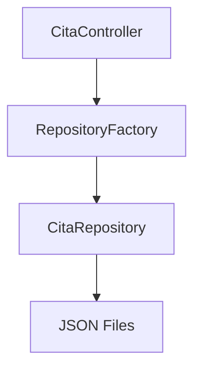
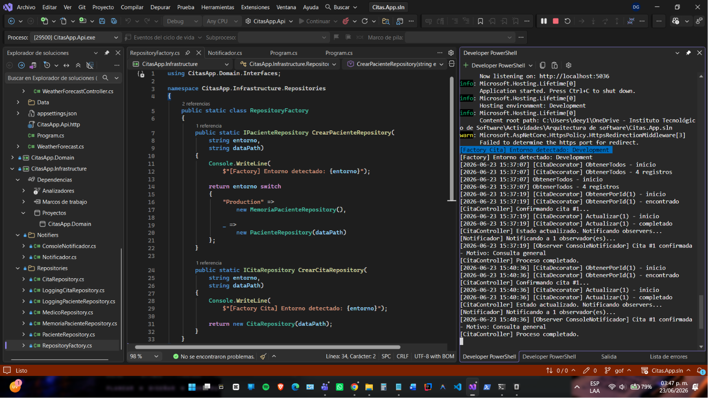
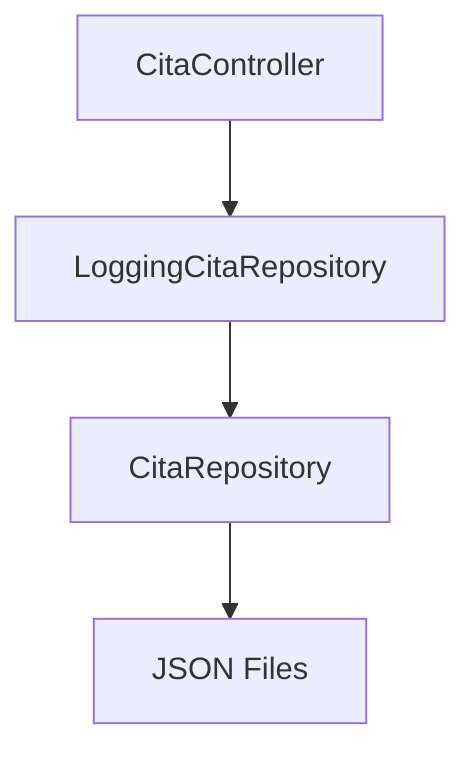
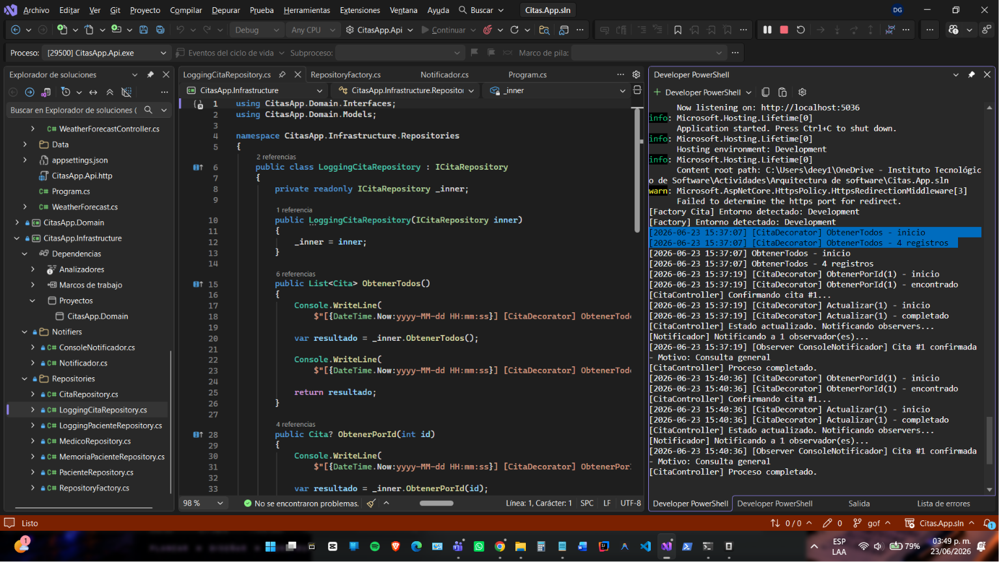
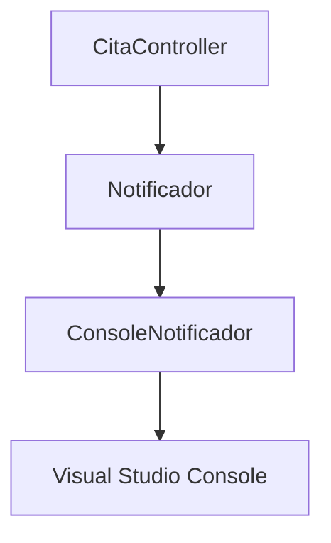
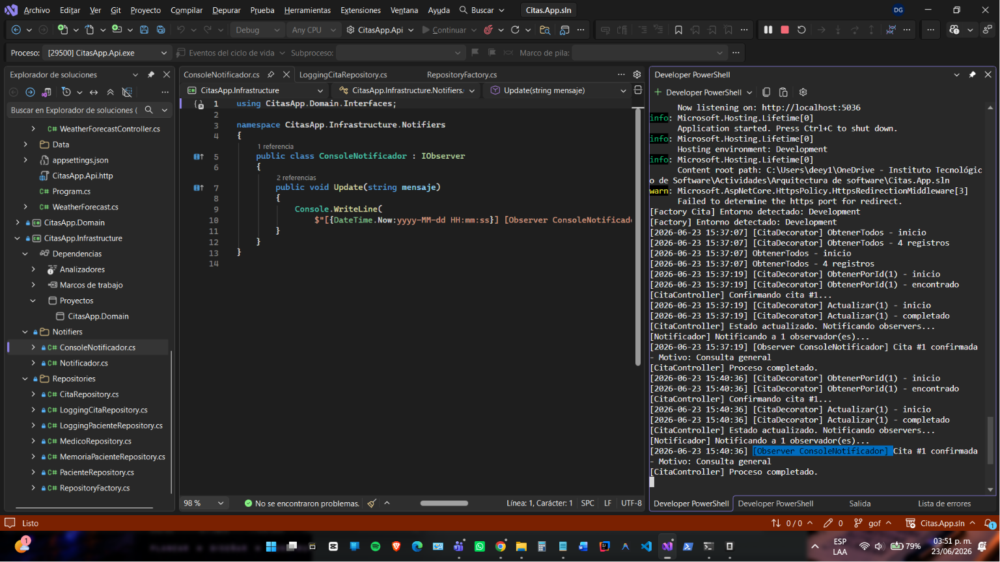
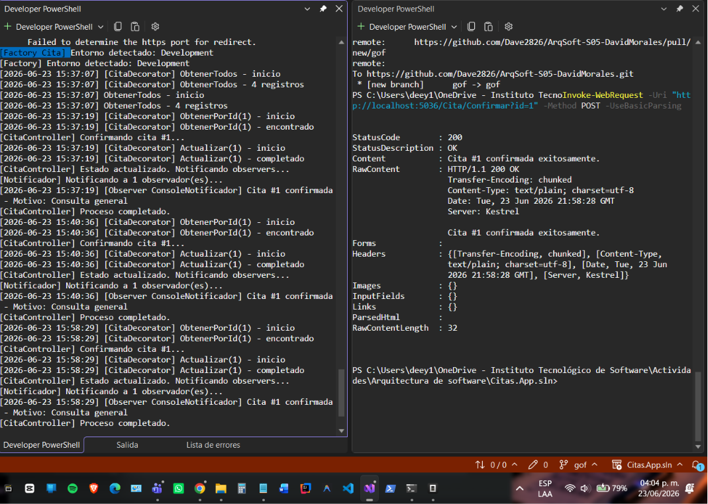
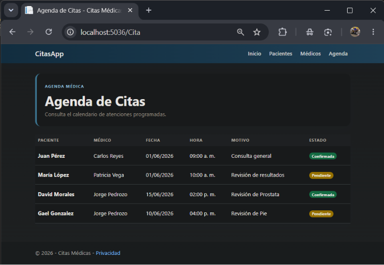
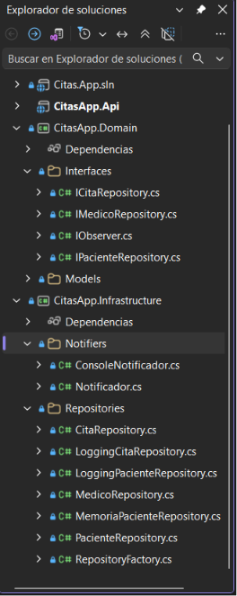
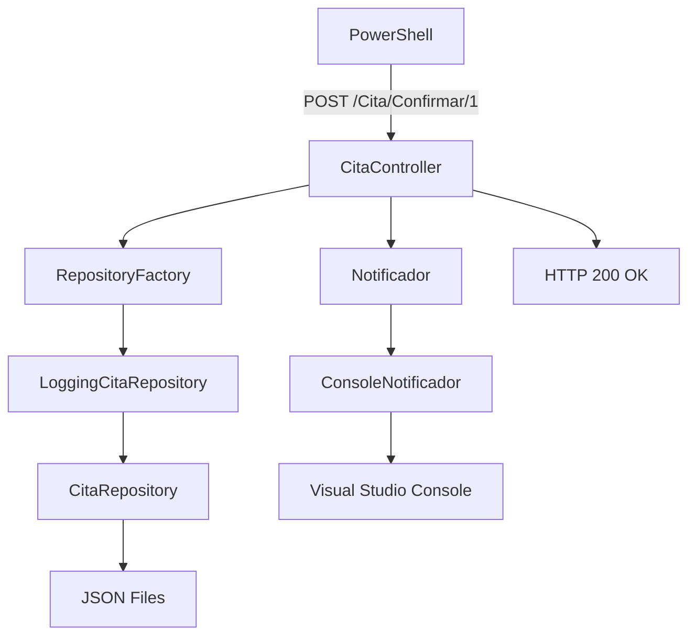

# Documentación – Patrones GOF: Factory, Decorator y Observer

**Alumno:** David Morales Guerrero

**Materia:** Arquitectura de Software

**Profesor:** Jorge Javier Pedrozo

**Proyecto:** CitasApp

**Fecha:** 23/06/2026

---

# Información General

**Materia:** Arquitectura de Software

**Proyecto:** CitasApp

**Arquitectura utilizada:** Hexagonal (Ports and Adapters) con Patrones de Diseño GOF

**Rama de trabajo:** gof

**Actividad:** Puntos Extra – Implementación de Patrones de Diseño GOF

---

# Objetivo

Implementar los patrones de diseño GOF (Gang of Four) Factory, Decorator y Observer sobre la arquitectura hexagonal existente del proyecto CitasApp, aplicándolos al flujo de pacientes y citas médicas con evidencia visible en la consola de Visual Studio.

---

# Patrón Factory

## Descripción

El patrón Factory (Factory Method) proporciona una interfaz para crear objetos sin especificar la clase concreta que se va a instanciar. La decisión sobre qué clase crear se delega a un método especializado dentro de una clase separada.

## Implementación en CitasApp

Se creó la clase estática **RepositoryFactory** dentro del proyecto Infrastructure con dos métodos:

* `CrearPacienteRepository` – retorna `IPacienteRepository` y selecciona entre `PacienteRepository` (desarrollo) o `MemoriaPacienteRepository` (producción) según el entorno.
* `CrearCitaRepository` – retorna `ICitaRepository` y crea una instancia de `CitaRepository`.

Ambos métodos escriben en consola el entorno detectado como evidencia visual.



## Código relevante

```csharp
public static ICitaRepository CrearCitaRepository(
    string entorno,
    string dataPath)
{
    Console.WriteLine(
        $"[Factory Cita] Entorno detectado: {entorno}");

    return new CitaRepository(dataPath);
}
```

Figura 1. Evidencia del patrón Factory ejecutándose en consola.



---

# Patrón Decorator

## Descripción

El patrón Decorator permite agregar responsabilidades adicionales a un objeto de forma dinámica sin modificar su clase. Se implementa creando un envoltorio que implementa la misma interfaz y delega en el objeto real.

## Implementación en CitasApp

Se creó la clase **LoggingCitaRepository** que implementa `ICitaRepository`. Recibe un `ICitaRepository` interno por constructor y envuelve cada método con mensajes de consola antes y después de delegar en el repositorio real.

De esta forma, al invocar `ObtenerPorId` o `Actualizar`, la consola muestra marcas de tiempo y descripciones de la operación realizadas.



## Código relevante

```csharp
public class LoggingCitaRepository : ICitaRepository
{
    private readonly ICitaRepository _inner;

    public LoggingCitaRepository(ICitaRepository inner)
    {
        _inner = inner;
    }

    public void Actualizar(Cita citaActualizada)
    {
        Console.WriteLine(
            $"[{DateTime.Now:yyyy-MM-dd HH:mm:ss}] [CitaDecorator] " +
            $"Actualizar({citaActualizada.Id}) - inicio");

        _inner.Actualizar(citaActualizada);

        Console.WriteLine(
            $"[{DateTime.Now:yyyy-MM-dd HH:mm:ss}] [CitaDecorator] " +
            $"Actualizar({citaActualizada.Id}) - completado");
    }
}
```

Este decorator sigue el mismo patrón que **LoggingPacienteRepository**, previamente implementado para el flujo de pacientes.

Figura 2. Evidencia del patrón Decorator ejecutándose en consola.



---

# Patrón Observer

## Descripción

El patrón Observer define una dependencia de uno a muchos entre objetos, de modo que cuando un objeto cambia su estado, todos los objetos dependientes son notificados y actualizados automáticamente.

## Implementación en CitasApp

Se implementaron tres componentes:

### IObserver (Interfaz en Domain)

Define el contrato que deben cumplir los observadores concretos.

```csharp
public interface IObserver
{
    void Update(string mensaje);
}
```

### Notificador (Sujeto concreto en Infrastructure)

Mantiene una lista de observadores y los notifica cuando ocurre un evento.

```csharp
public class Notificador
{
    private readonly List<IObserver> _observers = [];

    public void Attach(IObserver observer)
    {
        _observers.Add(observer);
    }

    public void Detach(IObserver observer)
    {
        _observers.Remove(observer);
    }

    public void Notificar(string mensaje)
    {
        Console.WriteLine(
            $"[Notificador] Notificando a {_observers.Count} observador(es)...");

        foreach (var observer in _observers)
        {
            observer.Update(mensaje);
        }
    }
}
```

### ConsoleNotificador (Observer concreto en Infrastructure)

Implementa `IObserver` y escribe el mensaje recibido en la consola.

```csharp
public class ConsoleNotificador : IObserver
{
    public void Update(string mensaje)
    {
        Console.WriteLine(
            $"[{DateTime.Now:yyyy-MM-dd HH:mm:ss}] " +
            $"[Observer ConsoleNotificador] {mensaje}");
    }
}
```

## Registro en Program.cs

```csharp
var notificador = new Notificador();
notificador.Attach(new ConsoleNotificador());
builder.Services.AddSingleton(notificador);
```



Figura 3. Evidencia del patrón Observer ejecutándose en consola tras confirmar una cita.



---

# Endpoint POST de Confirmación

Se agregó una acción `[HttpPost] Confirmar(int id)` en el `CitaController` existente para permitir la confirmación de citas mediante una petición HTTP POST.

## Código relevante

```csharp
[HttpPost]
public IActionResult Confirmar(int id)
{
    var cita = citaRepository.ObtenerPorId(id);

    if (cita == null)
        return NotFound();

    cita.Estado = "Confirmada";
    citaRepository.Actualizar(cita);

    _notificador.Notificar(
        $"Cita #{id} confirmada - Motivo: {cita.Motivo}");

    return Ok($"Cita #{id} confirmada exitosamente.");
}
```

## Prueba desde PowerShell

```powershell
Invoke-WebRequest -Uri "http://localhost:5036/Cita/Confirmar/1" -Method Post
```

Figura 4. Evidencia de la petición POST desde PowerShell.



---

# Actualización de Agenda

Después de confirmar una cita mediante POST, el cambio de estado se refleja en la vista de agenda al navegar a `/Cita`. La cita confirmada muestra la etiqueta "Confirmada" en la columna Estado.

Figura 5. Agenda actualizada con cita confirmada.



---

# Estructura Final del Proyecto

```text
Citas.App.sln
│
├── CitasApp.Domain
│   ├── Models
│   │   ├── Paciente.cs
│   │   ├── Medico.cs
│   │   └── Cita.cs
│   └── Interfaces
│       ├── IPacienteRepository.cs
│       ├── IMedicoRepository.cs
│       ├── ICitaRepository.cs
│       └── IObserver.cs              ← NUEVO
│
├── CitasApp.Infrastructure
│   ├── Repositories
│   │   ├── PacienteRepository.cs
│   │   ├── MedicoRepository.cs
│   │   ├── CitaRepository.cs
│   │   ├── MemoriaPacienteRepository.cs
│   │   ├── LoggingPacienteRepository.cs
│   │   ├── LoggingCitaRepository.cs  ← NUEVO
│   │   └── RepositoryFactory.cs
│   ├── Notifiers                     ← NUEVA CARPETA
│   │   ├── Notificador.cs            ← NUEVO
│   │   └── ConsoleNotificador.cs     ← NUEVO
│   └── CitasApp.Infrastructure.csproj
│
└── Citas.App.sln
    ├── Controllers
    │   ├── HomeController.cs
    │   ├── PacienteController.cs
    │   ├── MedicoController.cs
    │   └── CitaController.cs         ← MODIFICADO (POST Confirmar)
    ├── Views
    ├── ViewModels
    ├── Data
    ├── Program.cs                    ← MODIFICADO (DI)
    └── Citas.App.sln.csproj
```

Figura 6. Estructura final del proyecto con los patrones GOF integrados.



---

# Flujo de Ejecución



---

# Resultados

* Se implementaron tres patrones GOF sobre la arquitectura hexagonal existente.
* Factory: `RepositoryFactory` decide qué implementación concreta crear según el entorno.
* Decorator: `LoggingCitaRepository` agrega logging a las operaciones del repositorio sin modificar su código.
* Observer: `Notificador` + `ConsoleNotificador` notifican eventos de confirmación de citas.
* El proyecto compila correctamente con 0 errores y 0 advertencias.
* La evidencia de cada patrón es visible en la consola de Visual Studio durante la ejecución.

---

# Conclusión

La implementación de los patrones Factory, Decorator y Observer sobre la arquitectura hexagonal de CitasApp permitió:

* Centralizar la creación de repositorios en una sola clase (Factory).
* Agregar logging transversal sin modificar los repositorios existentes (Decorator).
* Desacoplar la notificación de eventos de la lógica de negocio (Observer).

Los tres patrones se integraron respetando la arquitectura actual del proyecto, sin modificar el núcleo del dominio ni los controladores existentes más allá de la acción POST requerida. La solución compila correctamente y produce evidencia visible en consola, cumpliendo con los objetivos académicos de la actividad.
