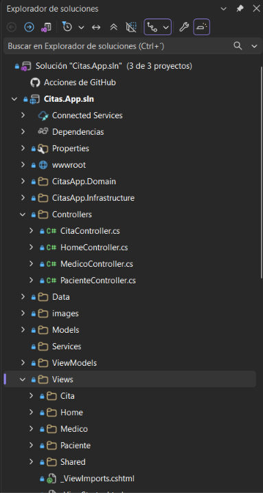
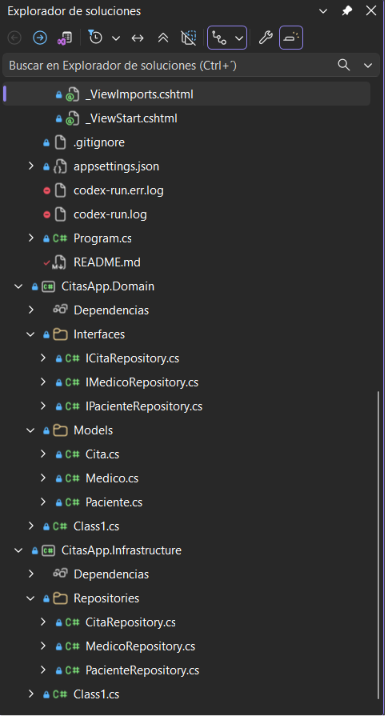
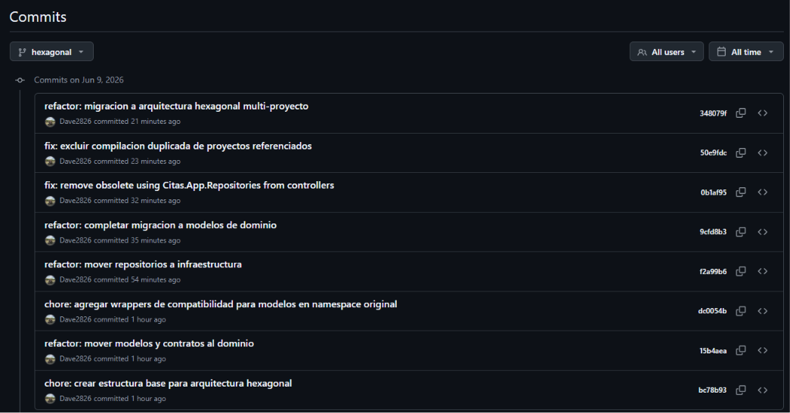

# CitasApp

Aplicación web desarrollada con ASP.NET Core MVC para la gestión básica de pacientes, médicos y citas médicas.

## Descripción

CitasApp es una práctica académica desarrollada en la materia de Arquitectura de Software. El proyecto inició como una aplicación MVC tradicional y posteriormente evolucionó hacia una arquitectura hexagonal multi-proyecto (Ports & Adapters), permitiendo una mejor separación de responsabilidades entre la lógica de negocio, la infraestructura y la capa de presentación.

La aplicación permite consultar pacientes, médicos y citas médicas desde una interfaz web moderna y responsive. La persistencia se realiza mediante archivos JSON, eliminando la necesidad de una base de datos para fines académicos.

## Tecnologías utilizadas

* ASP.NET Core MVC
* C#
* Bootstrap 5
* JSON
* Arquitectura Hexagonal (Ports & Adapters)
* Dependency Injection
* Git
* GitHub
* Visual Studio 2022

## Funcionalidades

### Pacientes

* Consulta de pacientes registrados.
* Visualización de información detallada.
* Navegación sencilla mediante interfaz web.

### Médicos

* Consulta de médicos registrados.
* Visualización de especialidades.
* Consulta de licencias profesionales.
* Vista detallada de cada médico.

### Agenda de citas

* Consulta general de citas médicas.
* Consulta filtrada por paciente.
* Visualización de fecha, hora, motivo y estado.
* Relación entre pacientes y médicos.

### Persistencia

* Almacenamiento de información mediante archivos JSON.
* Lectura de datos mediante repositorios.
* Separación entre dominio, infraestructura y presentación.

## Evolución del proyecto

Durante el desarrollo se realizaron las siguientes etapas:

1. Implementación inicial utilizando ASP.NET Core MVC.
2. Creación de Models, Controllers y Views.
3. Incorporación de persistencia mediante archivos JSON.
4. Implementación de repositorios para acceso a datos.
5. Mejora visual de la interfaz de usuario.
6. Migración a arquitectura hexagonal multi-proyecto.
7. Separación de responsabilidades mediante Domain e Infrastructure.
8. Inyección de dependencias mediante interfaces y adaptadores.

## Arquitectura del proyecto

La solución está organizada siguiendo una arquitectura hexagonal (Ports & Adapters), permitiendo desacoplar la lógica de negocio de los mecanismos de persistencia y de la interfaz web.

### CitasApp.Domain

Contiene el núcleo del sistema:

* Entidades del dominio.
* Interfaces (puertos) utilizadas por la aplicación.
* Contratos que definen el acceso a los datos.

### CitasApp.Infrastructure

Contiene los adaptadores de infraestructura:

* Implementaciones de los repositorios.
* Persistencia mediante archivos JSON.
* Acceso a los datos almacenados.

### Proyecto Web (ASP.NET Core MVC)

Contiene la capa de presentación:

* Controllers
* Views
* ViewModels

Los controladores dependen de interfaces del dominio y reciben sus implementaciones mediante Dependency Injection.

### Flujo de trabajo

```text
Usuario
   │
   ▼
Controllers (MVC)
   │
   ▼
Interfaces (Domain)
   │
   ▼
Repositories (Infrastructure)
   │
   ▼
Archivos JSON
```

## Estructura principal

```text
CitasApp.Domain/
├── Interfaces/
└── Models/

CitasApp.Infrastructure/
└── Repositories/

Controllers/
Views/
ViewModels/
Data/
wwwroot/
Program.cs
```

## Capturas de pantalla

### Página principal


### Pacientes


### Detalle de paciente


### Médicos


### Detalle médico


### Agenda de citas


### Persistencia JSON


### Arquitectura Hexagonal




La solución fue migrada a una arquitectura hexagonal multi-proyecto, separando claramente las responsabilidades entre dominio, infraestructura y presentación.

### Historial de commits



## Uso de Inteligencia Artificial

Se utilizó inteligencia artificial como herramienta de apoyo para resolver dudas puntuales relacionadas con:

* Arquitectura MVC.
* Arquitectura Hexagonal.
* Persistencia mediante JSON.
* Organización de proyectos ASP.NET Core.
* Dependency Injection.
* Validación de soluciones y resolución de dudas técnicas.

El análisis, implementación, pruebas, depuración, integración y comprensión del código fueron realizados de manera independiente.

## Autor

David Morales Guerrero

Tecnológico del Software

Materia: Arquitectura de Software

2026
