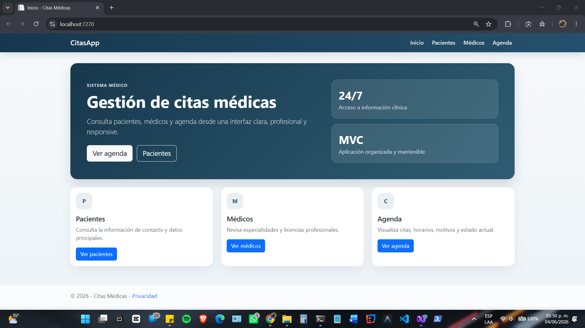
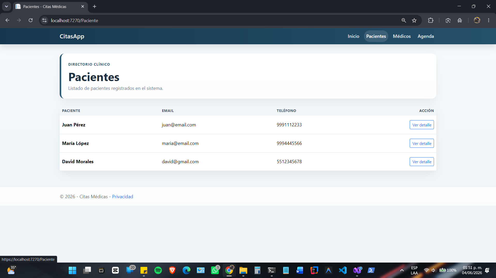
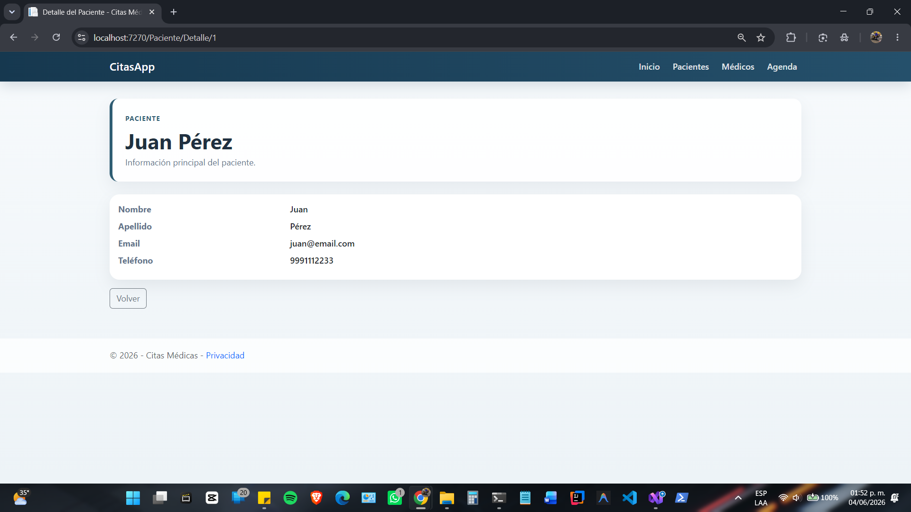
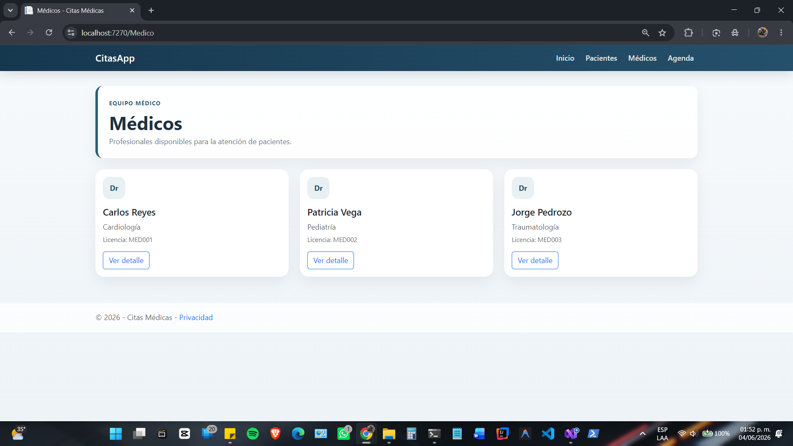
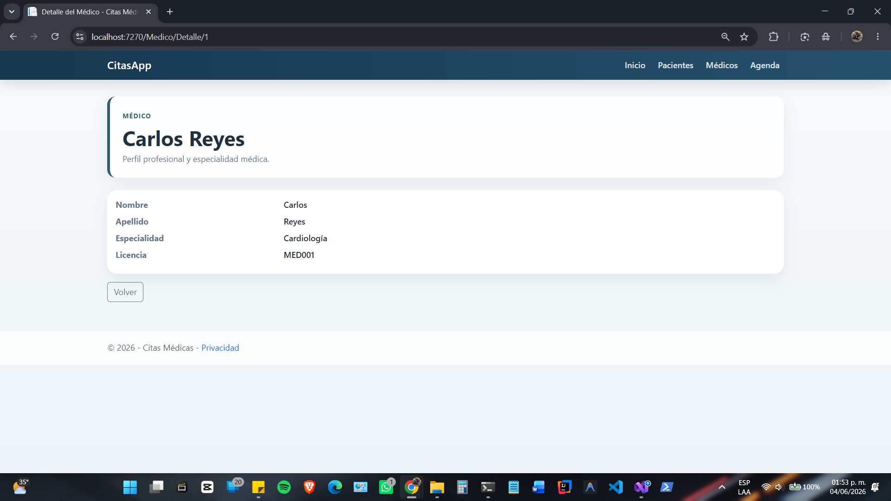
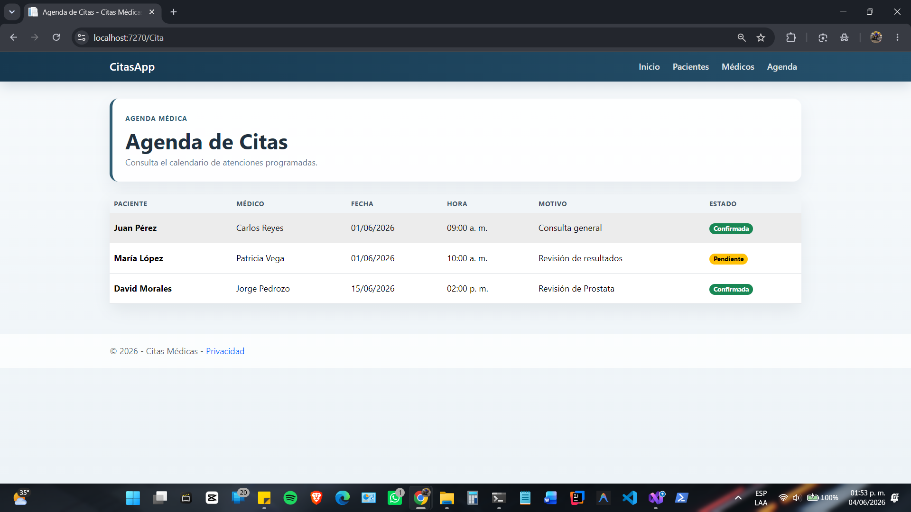
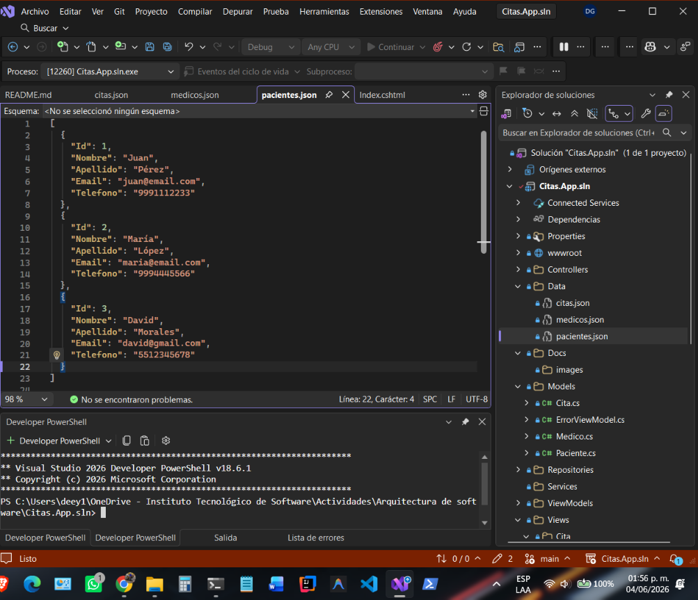
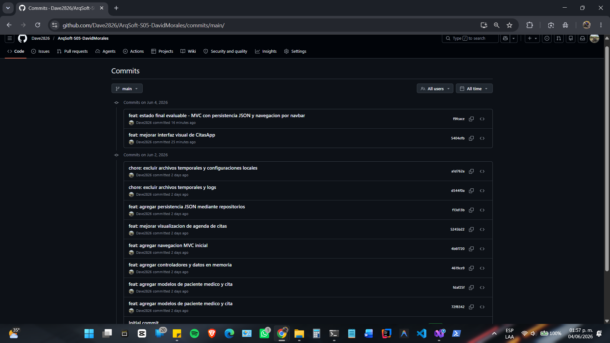

# CitasApp

Aplicación web desarrollada con ASP.NET Core MVC para la gestión básica de pacientes, médicos y citas médicas.

## Descripción

CitasApp es una práctica académica enfocada en la implementación del patrón MVC (Model-View-Controller) utilizando ASP.NET Core. El proyecto permite visualizar información de pacientes, médicos y citas desde una interfaz web organizada y responsive.

La aplicación utiliza persistencia mediante archivos JSON y una arquitectura basada en Models, Views, Controllers y Repositories para mantener una separación clara de responsabilidades.

## Tecnologías utilizadas

* ASP.NET Core MVC
* C#
* Bootstrap 5
* JSON
* Git
* GitHub
* Visual Studio 2022

## Funcionalidades

### Pacientes

* Consulta de pacientes registrados.
* Visualización de detalles individuales.

### Médicos

* Consulta de médicos registrados.
* Visualización de detalles individuales.
* Consulta de especialidades y licencias.

### Agenda de citas

* Consulta de citas médicas.
* Consulta de citas filtradas por paciente.
* Visualización de fecha, hora, motivo y estado.

### Persistencia

* Almacenamiento de información en archivos JSON.
* Lectura de datos mediante repositorios.
* Separación entre la capa de presentación y acceso a datos.

## Arquitectura del proyecto

El proyecto está organizado siguiendo el patrón MVC:

* Models: representan las entidades del dominio.
* Views: contienen la interfaz de usuario.
* Controllers: coordinan la interacción entre vistas y datos.
* Repositories: encapsulan el acceso a los archivos JSON.
* ViewModels: preparan la información para ser mostrada en las vistas.
* Data: almacena los archivos JSON utilizados como persistencia.

## Estructura principal

```text
Controllers/
Models/
ViewModels/
Repositories/
Views/
Data/
wwwroot/
```

## Capturas de pantalla

### Página principal



### Pacientes



### Detalle de paciente



### Médicos



### Detalle médico



### Agenda de citas



### Citas por paciente


### Persistencia JSON



### Historial de commits



## Uso de Inteligencia Artificial

Se utilizó inteligencia artificial como herramienta de apoyo para resolver dudas puntuales relacionadas con la organización del proyecto, arquitectura MVC, persistencia JSON y validación de soluciones.

El análisis, implementación, pruebas, depuración, integración y comprensión del código fueron realizados de manera independiente.

## Autor

David Morales Guerrero

Tecnológico del Software

Arquitectura de Software

2026
