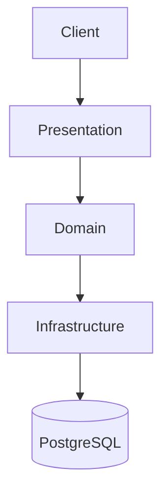
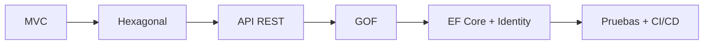

# CitasApp

Aplicación web desarrollada con ASP.NET Core MVC para la gestión de pacientes, médicos y citas médicas, con autenticación, pruebas unitarias e integración continua.

## Descripción

CitasApp es una práctica académica desarrollada en la materia de Arquitectura de Software. El proyecto inició como una aplicación MVC tradicional y evolucionó hacia una arquitectura hexagonal multi-proyecto (Ports & Adapters) con persistencia en PostgreSQL mediante Entity Framework Core, autenticación con ASP.NET Core Identity, pruebas unitarias con xUnit y un pipeline de integración continua con GitHub Actions.


```mermaid
graph TB
    Client --> Presentation
    Presentation --> Domain
    Domain --> Infrastructure
    Infrastructure --> DB[(PostgreSQL)]
```

## Características principales

- ASP.NET Core MVC
- Arquitectura Hexagonal (Ports & Adapters)
- Entity Framework Core
- PostgreSQL
- ASP.NET Core Identity
- Patrones GOF (Factory, Decorator y Observer)
- Persistencia mediante EF Core
- Pruebas unitarias con xUnit
- Pipeline CI mediante GitHub Actions

## Tecnologías utilizadas

* ASP.NET Core MVC
* C#
* Bootstrap 5
* .NET 10
* Arquitectura Hexagonal (Ports & Adapters)
* Entity Framework Core
* PostgreSQL
* ASP.NET Core Identity
* Dependency Injection
* Patrones GOF (Factory, Decorator y Observer)
* xUnit
* Moq
* GitHub Actions
* Git
* GitHub
* Visual Studio 2022 / Visual Studio 2026
* PowerShell

## Ramas del repositorio

| Rama | Propósito |
|------|-----------|
| main | Aplicación MVC con persistencia JSON |
| hexagonal | Migración a arquitectura hexagonal multi-proyecto |
| api-rest | Implementación de API REST |
| gof | Implementación de Factory, Decorator y Observer |
| code-smells | Refactorización, EF Core, Identity, pruebas y CI/CD |
| CI/CD | Integración continua con GitHub Actions |

Cada rama representa una etapa evolutiva del proyecto.

## Funcionalidades

### Pacientes

* Consulta de pacientes registrados.
* Visualización de información detallada.
* Navegación sencilla mediante interfaz web.

### Médicos

* Consulta de médicos registrados.
* Visualización de especialidades.
* Consulta de licencias profesionales.
* Vista detallada de cada médico.

### Agenda de citas

* Consulta general de citas médicas.
* Consulta filtrada por paciente.
* Visualización de fecha, hora, motivo y estado.
* Relación entre pacientes y médicos.

### Persistencia

* Almacenamiento en PostgreSQL mediante Entity Framework Core.
* Repositorios con operaciones CRUD.
* Migraciones para evolución del esquema.
* Separación entre dominio, infraestructura y presentación.

### Autenticación

* Inicio de sesión con ASP.NET Core Identity.
* Usuario administrador preconfigurado.

## Actividades académicas

### Arquitectura Hexagonal

Migración de MVC tradicional a arquitectura hexagonal (Ports & Adapters), separando el dominio, la infraestructura y la presentación en proyectos independientes.

[Documentación completa](Documentacion-Arquitectura-Hexagonal.md)


### API REST

Exposición de la información del sistema de citas médicas mediante endpoints HTTP, reutilizando la arquitectura hexagonal existente sin modificar la lógica de negocio.

[Documentación completa](Documentacion-API-REST.md)


### Patrones GOF

Implementación de los patrones de diseño Factory, Decorator y Observer sobre la arquitectura hexagonal:

* **Factory:** `RepositoryFactory` centraliza la creación de repositorios según el entorno.
* **Decorator:** `LoggingPacienteRepository` y `LoggingCitaRepository` agregan logging sin modificar los repositorios reales.
* **Observer:** `Notificador` y `ConsoleNotificador` notifican eventos de confirmación de citas en consola.

[Documentación completa](Documentacion-GOF-Factory-Decorator-Observer.md)

  

### Pruebas Unitarias y CI/CD

Implementación de un conjunto de 20 pruebas unitarias con xUnit (AAA) y un pipeline de integración continua con GitHub Actions:

* **NotificadorTests:** 6 pruebas para el patrón Observer (attach, detach, notificar, múltiples observadores, sin observadores).
* **LoggingCitaRepositoryTests:** 6 pruebas para el patrón Decorator (delegación de operaciones CRUD, propagación de valores nulos/vacíos).
* **CitasAppDbContextTests:** 8 pruebas para la configuración de EF Core (DbSet, persistencia de Paciente/Medico/Cita, relaciones, múltiples registros).
* **CI Pipeline:** Compilación y ejecución automática de pruebas en cada push y Pull Request a la rama principal.

## Endpoints principales de la API REST

| Método | Endpoint | Descripción |
|--------|----------|-------------|
| GET | /api/pacientes | Obtiene todos los pacientes |
| GET | /api/pacientes/{id} | Obtiene un paciente por id |
| GET | /api/medicos | Obtiene todos los médicos |
| GET | /api/medicos/{id} | Obtiene un médico por id |
| GET | /api/citas | Obtiene todas las citas |
| GET | /api/citas/{id} | Obtiene una cita por id |
| GET | /api/citas/porpaciente/{id} | Obtiene las citas de un paciente |
| GET | /api/calculadora/sumar | Operación de suma |
| GET | /api/calculadora/restar | Operación de resta |
| GET | /api/calculadora/multiplicar | Operación de multiplicación |
| GET | /api/calculadora/dividir | Operación de división |

## Evolución del proyecto

Durante el desarrollo se realizaron las siguientes etapas:

1. Implementación inicial utilizando ASP.NET Core MVC.
2. Incorporación de persistencia mediante archivos JSON.
3. Implementación de repositorios para acceso a datos.
4. Migración a arquitectura hexagonal multi-proyecto.
5. Implementación de API REST para exponer datos mediante endpoints HTTP.
6. Implementación del patrón Factory para creación de repositorios.
7. Implementación del patrón Decorator para logging en repositorios.
8. Implementación del patrón Observer para notificación de citas.
9. Migración a Entity Framework Core + PostgreSQL + ASP.NET Core Identity.
10. Implementación de pruebas unitarias con xUnit y pipeline CI/CD con GitHub Actions.


```mermaid
graph LR
    MVC --> Hexagonal
    Hexagonal --> API[API REST]
    API --> GOF
    GOF --> EF[EF Core + Identity]
    EF --> Tests[Pruebas + CI/CD]
```

## Arquitectura del proyecto

La solución está organizada siguiendo una arquitectura hexagonal (Ports & Adapters), permitiendo desacoplar la lógica de negocio de los mecanismos de persistencia y de la interfaz web.

Los patrones Factory, Decorator y Observer fueron incorporados durante la evolución del proyecto para demostrar principios de diseño orientado a objetos, desacoplamiento entre componentes y extensibilidad de la solución.

### CitasApp.Domain

Contiene el núcleo del sistema:

* Entidades del dominio.
* Interfaces (puertos) utilizadas por la aplicación.
* Contratos que definen el acceso a los datos.

### CitasApp.Infrastructure

Contiene los adaptadores de infraestructura:

* Implementaciones de los repositorios con EF Core.
* DbContext y migraciones para PostgreSQL.
* Notificadores del patrón Observer.
* Repositorios decorados con logging.

### CitasApp.Tests

Contiene las pruebas unitarias:

* Pruebas para el patrón Observer (Notificador).
* Pruebas para el patrón Decorator (LoggingCitaRepository).
* Pruebas para la configuración de EF Core (CitasAppDbContext).

### Proyecto Web (ASP.NET Core MVC)

Contiene la capa de presentación:

* Controllers
* Views
* ViewModels
* ASP.NET Core Identity (Login)

Los controladores dependen de interfaces del dominio y reciben sus implementaciones mediante Dependency Injection.

### Flujo de trabajo

```text
Usuario
   │
   ▼
Controllers (MVC)
   │
   ▼
Interfaces (Domain)
   │
   ▼
Repositories (Infrastructure)
   │
   ▼
Entity Framework Core → PostgreSQL
```

## Estructura principal

```text
CitasApp.Domain/
├── Interfaces/
│   ├── IPacienteRepository.cs
│   ├── IMedicoRepository.cs
│   ├── ICitaRepository.cs
│   └── IObserver.cs
└── Models/
    ├── Paciente.cs
    ├── Medico.cs
    └── Cita.cs

CitasApp.Infrastructure/
├── Data/
│   ├── CitasAppDbContext.cs
│   └── DbInitializer.cs
├── Repositories/
│   ├── PacienteRepository.cs
│   ├── MedicoRepository.cs
│   ├── CitaRepository.cs
│   ├── JsonRepository.cs
│   ├── MemoriaPacienteRepository.cs
│   ├── LoggingPacienteRepository.cs
│   ├── LoggingCitaRepository.cs
│   └── RepositoryFactory.cs
├── Notifiers/
│   ├── Notificador.cs
│   └── ConsoleNotificador.cs
└── Migrations/

CitasApp.Tests/
├── Notifiers/
│   └── NotificadorTests.cs
├── Repositories/
│   └── LoggingCitaRepositoryTests.cs
├── Persistence/
│   └── CitasAppDbContextTests.cs
└── CitasApp.Tests.csproj

Controllers/
├── HomeController.cs
├── AccountController.cs
├── PacienteController.cs
├── MedicoController.cs
└── CitaController.cs

Services/
├── ICitaService.cs
└── CitaService.cs

Views/
ViewModels/
Models/
Data/
wwwroot/
Program.cs
```

## Pipeline

El proyecto utiliza GitHub Actions para compilar y ejecutar automáticamente las pruebas unitarias en cada push y Pull Request.

**Workflow:** `.github/workflows/ci.yml`

**Trigger:**
- Push a las ramas `main` y `code-smells`
- Pull Requests hacia `main`

**Pasos del pipeline:**
1. Checkout del repositorio
2. Restauración de paquetes NuGet (`dotnet restore`)
3. Compilación del proyecto (`dotnet build --no-restore`)
4. Ejecución de las 20 pruebas unitarias (`dotnet test --no-build`)

## Capturas de pantalla

### Aplicación MVC

#### Pantalla principal


#### Login


#### Dashboard


#### Pacientes


#### Detalle de paciente


#### Médicos


#### Detalle médico


#### Agenda de citas


### Arquitectura Hexagonal

#### Separación de proyectos


### API REST

#### GET /api/pacientes


#### GET /api/medicos


#### GET /api/citas


#### GET /api/citas/porpaciente/{id}


### Patrones GOF

#### Factory


#### Decorator


#### Observer


#### Confirmación mediante POST


#### Estado actualizado en la agenda


### Pipeline GitHub Actions


## Cómo ejecutar

1. Restaurar paquetes:
   ```bash
   dotnet restore
   ```

2. Ejecutar migraciones (requiere PostgreSQL configurado en `appsettings.json`):
   ```bash
   dotnet ef database update --project CitasApp.Infrastructure --startup-project .
   ```

3. Ejecutar la aplicación:
   ```bash
   dotnet run
   ```

   La aplicación estará disponible en `http://localhost:5036`.

4. Usuario administrador creado automáticamente al iniciar:
   - Email: `admin@citasapp.com`
   - Contraseña: `Admin123!`

5. Ejecutar pruebas unitarias:
   ```bash
   dotnet test
   ```

## Uso de Inteligencia Artificial

Se utilizó inteligencia artificial como herramienta de apoyo para resolver dudas puntuales relacionadas con:

* Arquitectura MVC.
* Arquitectura Hexagonal.
* Persistencia mediante JSON.
* Organización de proyectos ASP.NET Core.
* Dependency Injection.
* Validación de soluciones y resolución de dudas técnicas.

El análisis, implementación, pruebas, depuración, integración y comprensión del código fueron realizados de manera independiente.

## Autor

David Morales Guerrero

Tecnológico del Software

Materia: Arquitectura de Software

2026
