# CitasApp

Aplicación web desarrollada con ASP.NET Core MVC para la gestión básica de pacientes, médicos y citas médicas.

## Descripción

CitasApp es una práctica académica desarrollada en la materia de Arquitectura de Software. El proyecto inició como una aplicación MVC tradicional y posteriormente evolucionó hacia una arquitectura hexagonal multi-proyecto (Ports & Adapters), permitiendo una mejor separación de responsabilidades entre la lógica de negocio, la infraestructura y la capa de presentación.

La aplicación permite consultar pacientes, médicos y citas médicas desde una interfaz web moderna y responsive. La persistencia se realiza mediante archivos JSON, eliminando la necesidad de una base de datos para fines académicos.

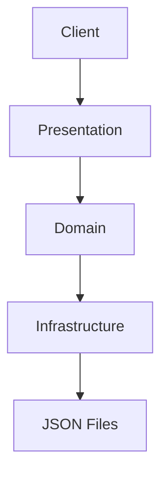
```mermaid
graph TB
    Client --> Presentation
    Presentation --> Domain
    Domain --> Infrastructure
    Infrastructure --> JSON[JSON Files]
```

## Tecnologías utilizadas

* ASP.NET Core MVC
* C#
* Bootstrap 5
* JSON
* .NET 10
* Arquitectura Hexagonal (Ports & Adapters)
* Dependency Injection
* Patrones GOF (Factory, Decorator y Observer)
* Git
* GitHub
* Visual Studio 2022 / Visual Studio 2026
* PowerShell

## Ramas del repositorio

| Rama | Propósito |
|------|-----------|
| main | Aplicación MVC con persistencia JSON |
| hexagonal | Migración a arquitectura hexagonal multi-proyecto |
| api-rest | Implementación de API REST |
| gof | Implementación de Factory, Decorator y Observer |

Cada rama representa una etapa evolutiva del proyecto.

## Funcionalidades

### Pacientes

* Consulta de pacientes registrados.
* Visualización de información detallada.
* Navegación sencilla mediante interfaz web.

### Médicos

* Consulta de médicos registrados.
* Visualización de especialidades.
* Consulta de licencias profesionales.
* Vista detallada de cada médico.

### Agenda de citas

* Consulta general de citas médicas.
* Consulta filtrada por paciente.
* Visualización de fecha, hora, motivo y estado.
* Relación entre pacientes y médicos.

### Persistencia

* Almacenamiento de información mediante archivos JSON.
* Lectura de datos mediante repositorios.
* Separación entre dominio, infraestructura y presentación.

## Actividades académicas

### Arquitectura Hexagonal

Migración de MVC tradicional a arquitectura hexagonal (Ports & Adapters), separando el dominio, la infraestructura y la presentación en proyectos independientes.

[Documentación completa](Documentacion-Arquitectura-Hexagonal.md)

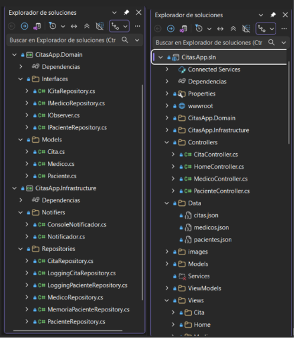

### API REST

Exposición de la información del sistema de citas médicas mediante endpoints HTTP, reutilizando la arquitectura hexagonal existente sin modificar la lógica de negocio.

[Documentación completa](Documentacion-API-REST.md)

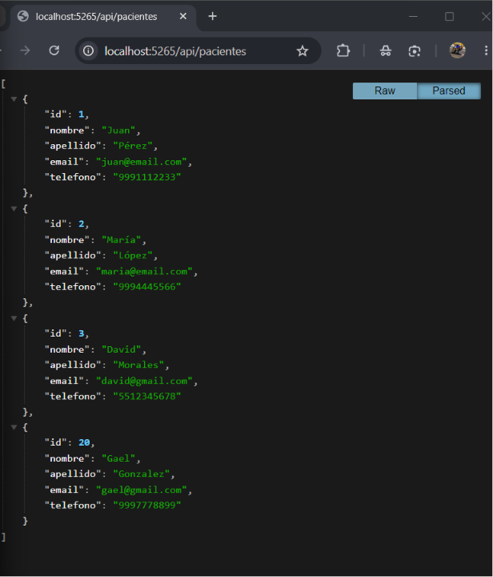

### Patrones GOF

Implementación de los patrones de diseño Factory, Decorator y Observer sobre la arquitectura hexagonal:

* **Factory:** `RepositoryFactory` centraliza la creación de repositorios según el entorno.
* **Decorator:** `LoggingPacienteRepository` y `LoggingCitaRepository` agregan logging sin modificar los repositorios reales.
* **Observer:** `Notificador` y `ConsoleNotificador` notifican eventos de confirmación de citas en consola.

[Documentación completa](Documentacion-GOF-Factory-Decorator-Observer.md)

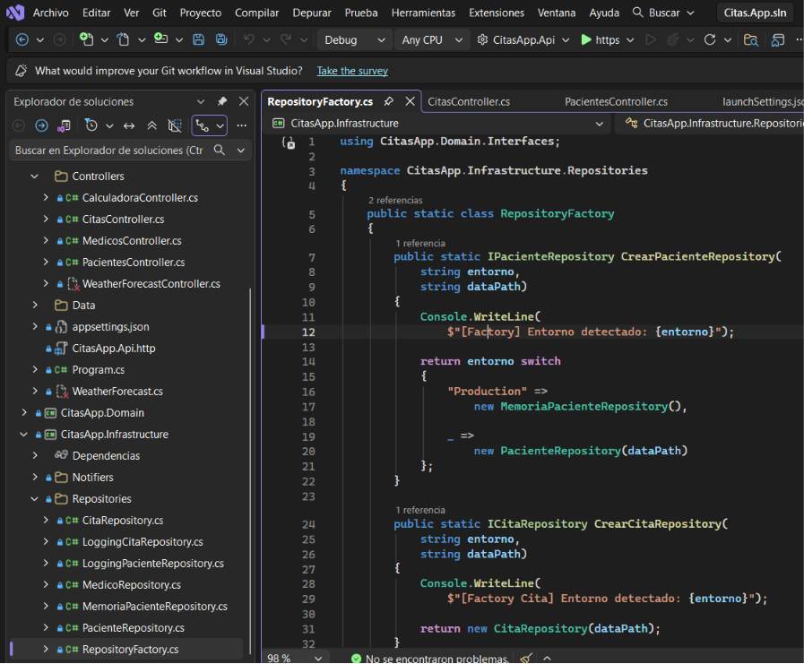 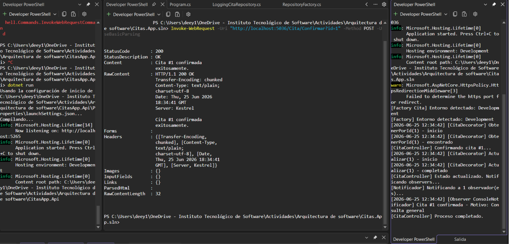 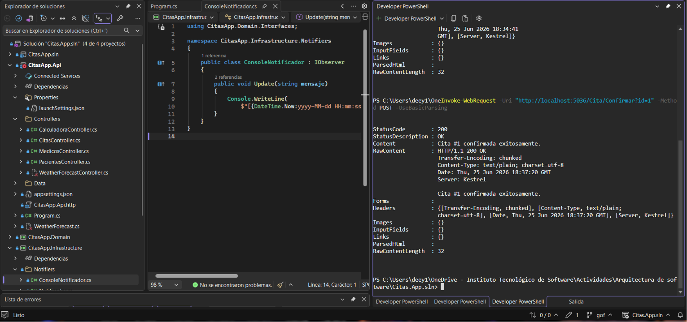

## Endpoints principales de la API REST

| Método | Endpoint | Descripción |
|--------|----------|-------------|
| GET | /api/pacientes | Obtiene todos los pacientes |
| GET | /api/pacientes/{id} | Obtiene un paciente por id |
| GET | /api/medicos | Obtiene todos los médicos |
| GET | /api/medicos/{id} | Obtiene un médico por id |
| GET | /api/citas | Obtiene todas las citas |
| GET | /api/citas/{id} | Obtiene una cita por id |
| GET | /api/citas/porpaciente/{id} | Obtiene las citas de un paciente |
| GET | /api/calculadora/sumar | Operación de suma |
| GET | /api/calculadora/restar | Operación de resta |
| GET | /api/calculadora/multiplicar | Operación de multiplicación |
| GET | /api/calculadora/dividir | Operación de división |

## Evolución del proyecto

Durante el desarrollo se realizaron las siguientes etapas:

1. Implementación inicial utilizando ASP.NET Core MVC.
2. Incorporación de persistencia mediante archivos JSON.
3. Implementación de repositorios para acceso a datos.
4. Migración a arquitectura hexagonal multi-proyecto.
5. Implementación de API REST para exponer datos mediante endpoints HTTP.
6. Implementación del patrón Factory para creación de repositorios.
7. Implementación del patrón Decorator para logging en repositorios.
8. Implementación del patrón Observer para notificación de citas.

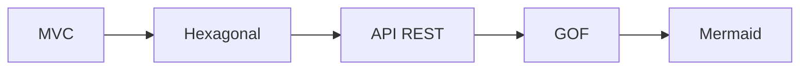
```mermaid
graph LR
    MVC --> Hexagonal
    Hexagonal --> API[API REST]
    API --> GOF
    GOF --> Mermaid
```

## Arquitectura del proyecto

La solución está organizada siguiendo una arquitectura hexagonal (Ports & Adapters), permitiendo desacoplar la lógica de negocio de los mecanismos de persistencia y de la interfaz web.

Los patrones Factory, Decorator y Observer fueron incorporados durante la evolución del proyecto para demostrar principios de diseño orientado a objetos, desacoplamiento entre componentes y extensibilidad de la solución.

### CitasApp.Domain

Contiene el núcleo del sistema:

* Entidades del dominio.
* Interfaces (puertos) utilizadas por la aplicación.
* Contratos que definen el acceso a los datos.

### CitasApp.Infrastructure

Contiene los adaptadores de infraestructura:

* Implementaciones de los repositorios.
* Persistencia mediante archivos JSON.
* Acceso a los datos almacenados.

### Proyecto Web (ASP.NET Core MVC)

Contiene la capa de presentación:

* Controllers
* Views
* ViewModels

Los controladores dependen de interfaces del dominio y reciben sus implementaciones mediante Dependency Injection.

### Flujo de trabajo

```text
Usuario
   │
   ▼
Controllers (MVC)
   │
   ▼
Interfaces (Domain)
   │
   ▼
Repositories (Infrastructure)
   │
   ▼
Archivos JSON
```

## Estructura principal

```text
CitasApp.Domain/
├── Interfaces/
│   ├── IPacienteRepository.cs
│   ├── IMedicoRepository.cs
│   ├── ICitaRepository.cs
│   └── IObserver.cs
└── Models/
    ├── Paciente.cs
    ├── Medico.cs
    └── Cita.cs

CitasApp.Infrastructure/
├── Repositories/
│   ├── PacienteRepository.cs
│   ├── MedicoRepository.cs
│   ├── CitaRepository.cs
│   ├── MemoriaPacienteRepository.cs
│   ├── LoggingPacienteRepository.cs
│   ├── LoggingCitaRepository.cs
│   └── RepositoryFactory.cs
└── Notifiers/
    ├── Notificador.cs
    └── ConsoleNotificador.cs

Controllers/
├── HomeController.cs
├── PacienteController.cs
├── MedicoController.cs
└── CitaController.cs

Views/
ViewModels/
Data/
wwwroot/
Program.cs
```

## Capturas de pantalla

### Aplicación MVC

#### Página principal

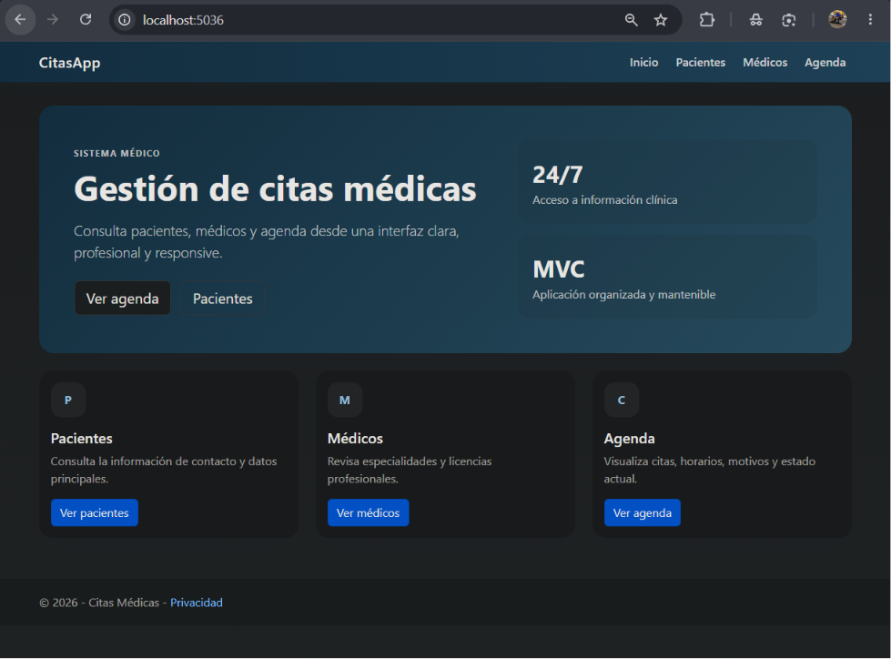

#### Pacientes

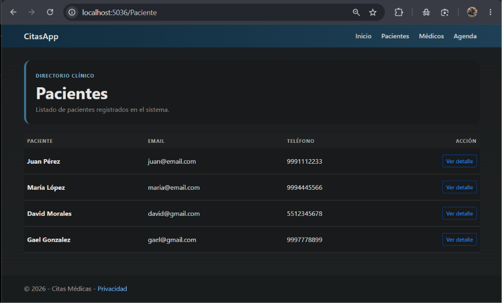

#### Detalle de paciente

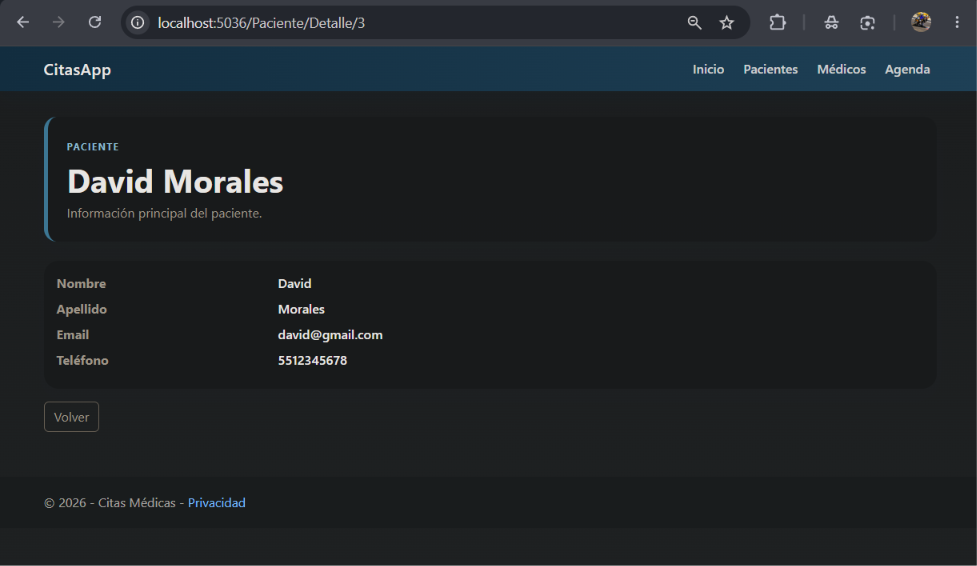

#### Médicos

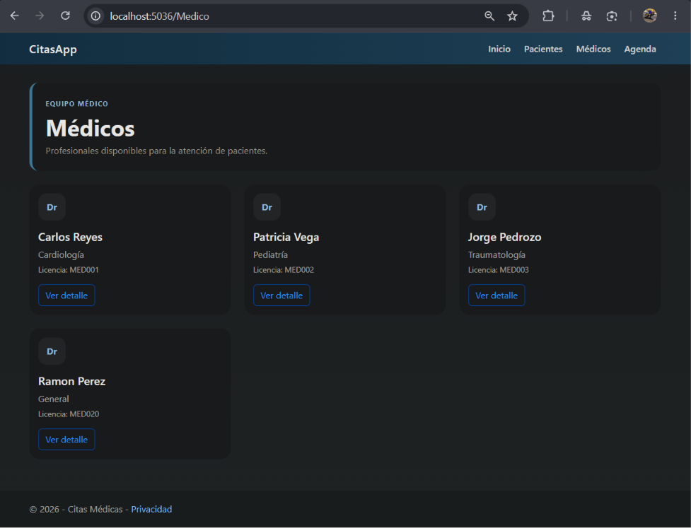

#### Detalle médico

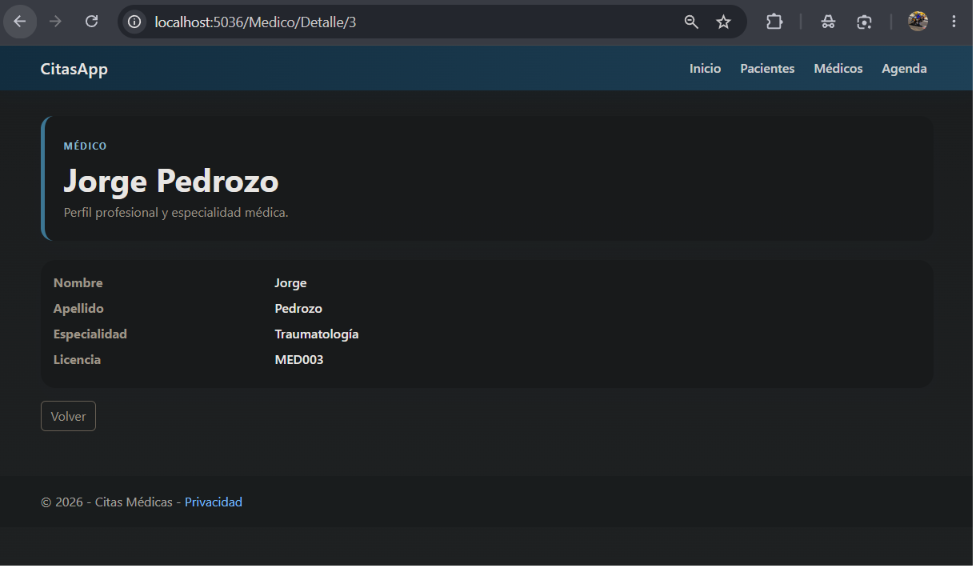

#### Agenda de citas

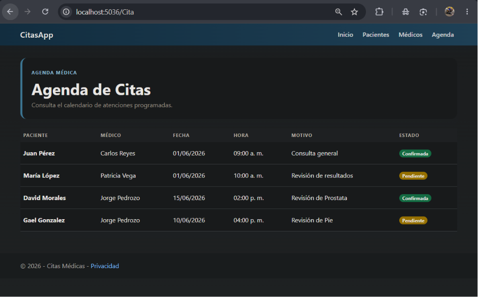

#### Persistencia JSON

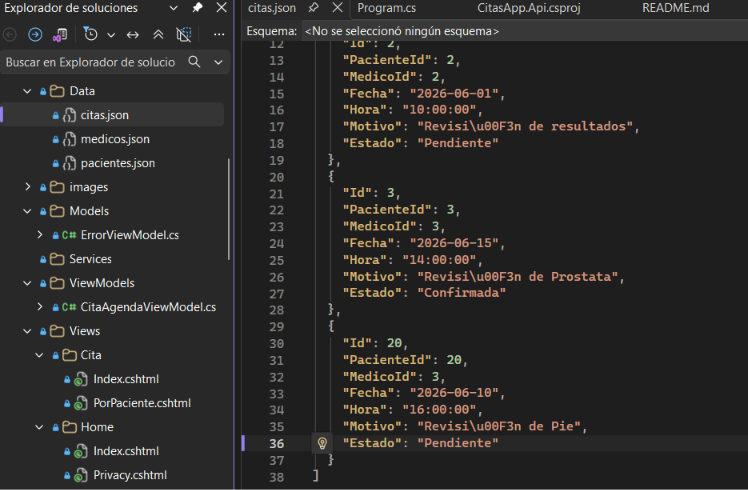

### Arquitectura Hexagonal

#### Separación de proyectos


### API REST

#### GET /api/pacientes


#### GET /api/medicos

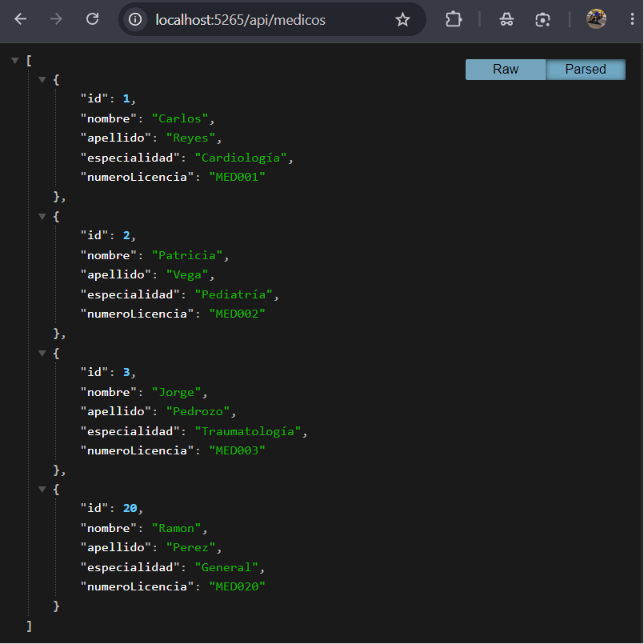

#### GET /api/citas

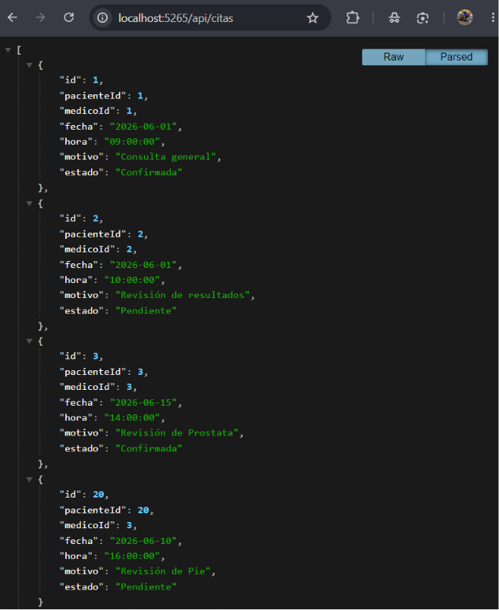

#### GET /api/citas/porpaciente/{id}

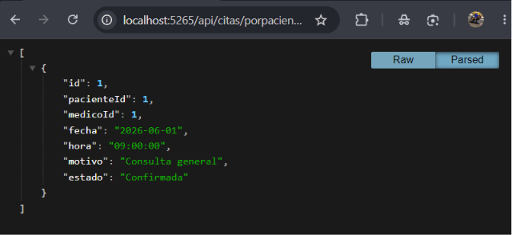

### Patrones GOF

#### Factory


#### Decorator


#### Observer


#### Confirmación mediante POST

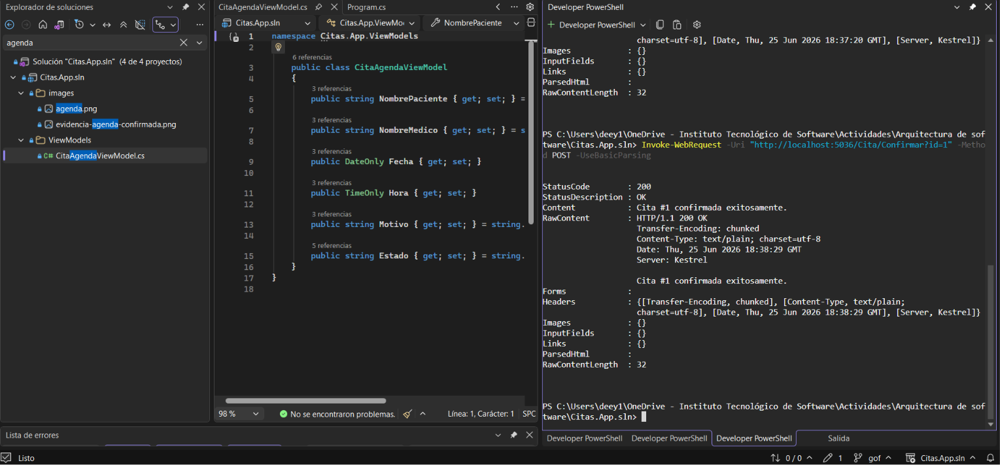

#### Estado actualizado en la agenda

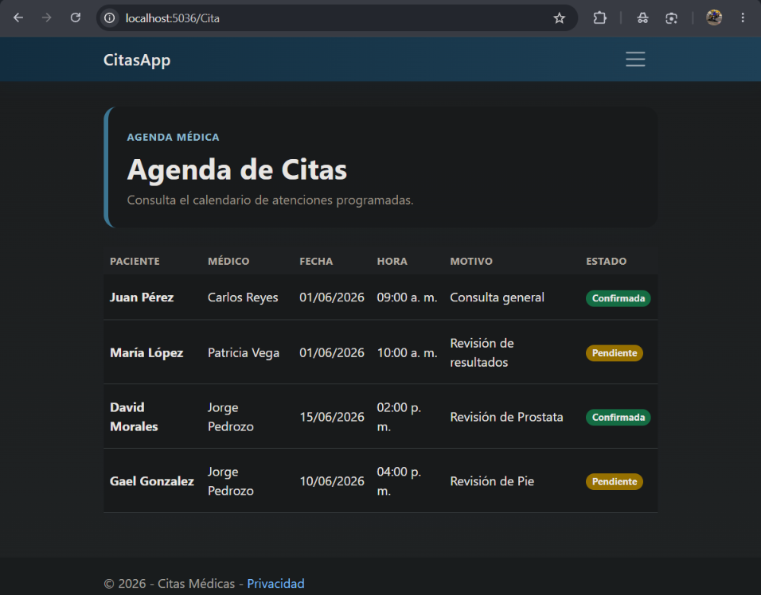

## Cómo ejecutar

```bash
dotnet restore
dotnet build
dotnet run
```

La aplicación estará disponible en `http://localhost:5036`.

## Uso de Inteligencia Artificial

Se utilizó inteligencia artificial como herramienta de apoyo para resolver dudas puntuales relacionadas con:

* Arquitectura MVC.
* Arquitectura Hexagonal.
* Persistencia mediante JSON.
* Organización de proyectos ASP.NET Core.
* Dependency Injection.
* Validación de soluciones y resolución de dudas técnicas.

El análisis, implementación, pruebas, depuración, integración y comprensión del código fueron realizados de manera independiente.

## Autor

David Morales Guerrero

Tecnológico del Software

Materia: Arquitectura de Software

2026
