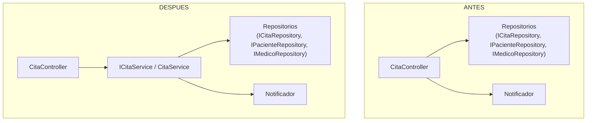
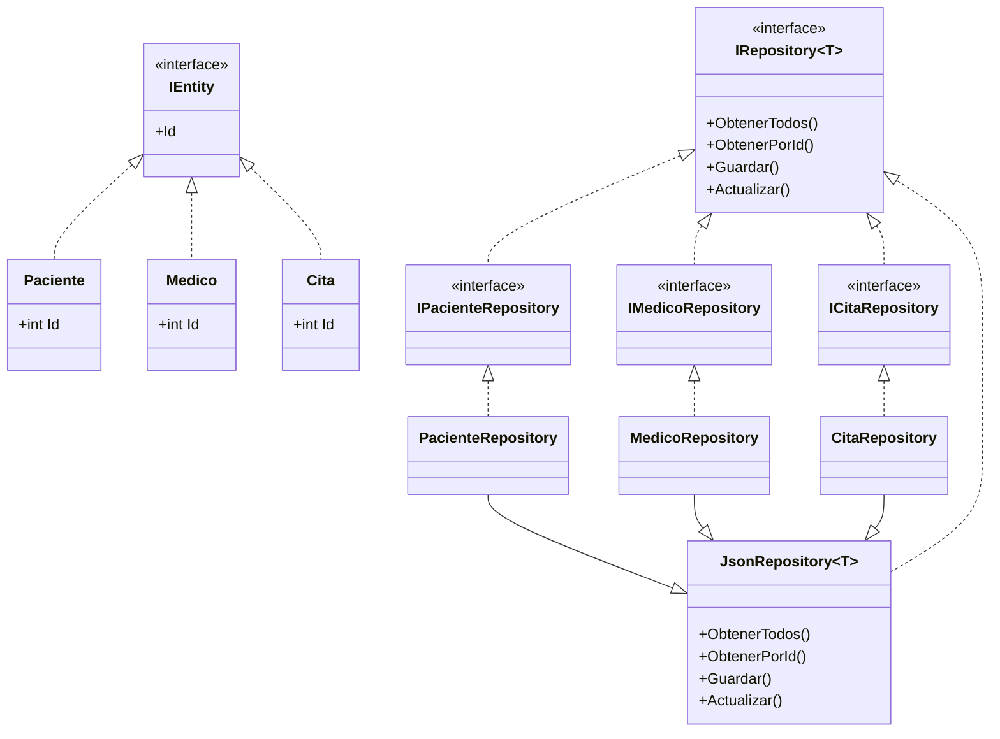
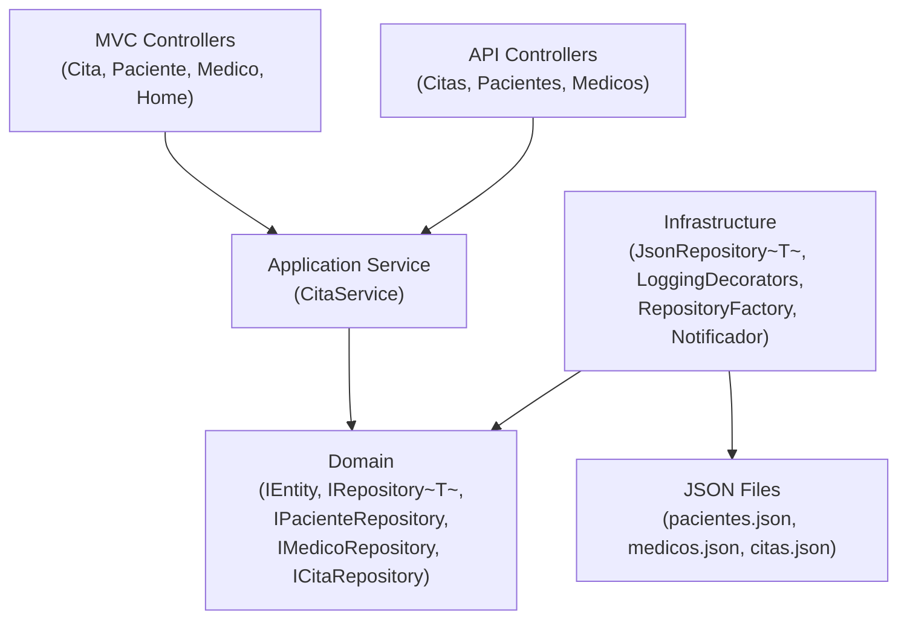

# ADR-001: Refactorización para eliminar Code Smells

| Campo | Valor |
|-------|-------|
| Estado | Aceptado |
| Fecha | 2026-07-14 |
| Autor | Alumno |
| Rama | `code-smells` |
| Actividad | #32 — Refactorización de Code Smells |

---

## 1. Resumen ejecutivo

Se realizó una auditoría de code smells sobre la totalidad del código fuente del proyecto. Se detectaron 17 hallazgos entre críticos, mayores y menores. Para esta actividad se seleccionaron únicamente dos code smells para corregir: un God Controller por violación de SRP en `CitaController` y duplicación de código en los tres repositorios JSON. Ambos fueron corregidos sin alterar el comportamiento funcional, sin modificar rutas, sin cambiar vistas y sin afectar la serialización de datos.

| Code Smell | Severidad original | Estado actual |
|------------|-------------------|---------------|
| God Controller / SRP | Crítica | Corregido |
| Duplicate Code (Repositorios) | Alta | Corregido |

---

## 2. Auditoría inicial

Antes de modificar el código se realizó una auditoría completa de code smells sobre los 5 proyectos del sistema (MVC, API REST, Domain, Infrastructure, ViewModels). Se analizaron 34 archivos fuente contra los catálogos de Martin Fowler (*Refactoring*), Robert C. Martin (*Clean Code*, SOLID), y los principios DRY, KISS y YAGNI.

La tabla siguiente resume los hallazgos ordenados por severidad. Solo dos fueron corregidos en esta actividad; el resto queda documentado como deuda técnica pendiente para actividades futuras.

| ID | Code Smell | Archivo principal | Severidad | Corregido |
|----|-----------|-------------------|-----------|-----------|
| C1 | Anemic Domain Model | `Domain/Models/Paciente.cs`, `Medico.cs`, `Cita.cs` | Crítica | No |
| C2 | Primitive Obsession | `Domain/Models/Cita.cs` (Estado, Motivo) | Crítica | No |
| C3 | God Controller / SRP | `Controllers/CitaController.cs` | Crítica | **Sí** |
| M1 | Duplicate Code (Repos) | `Infrastructure/Repositories/*Repository.cs` | Alta | **Sí** |
| M2 | Duplicate Code (Interfaces) | `Domain/Interfaces/*Repository.cs` | Alta | Parcial ¹ |
| M3 | Console.WriteLine sin abstracción | 10+ ubicaciones en Controllers, Infrastructure | Alta | No |
| M4 | Factory bug en Production | `RepositoryFactory.cs:16` | Alta | No |
| M5 | Comportamiento no-op silencioso | `MemoriaPacienteRepository.cs` | Alta | No |
| M6 | CalculadoraController (YAGNI) | `CitasApp.Api/Controllers/CalculadoraController.cs` | Alta | No |
| M7 | Exposición sin DTOs en API | `CitasApp.Api/Controllers/*` | Alta | No |
| M8 | Primitive Obsession en ViewModel | `ViewModels/CitaAgendaViewModel.cs` | Media | No |
| m1-m6 | Hallazgos menores | Múltiples archivos | Baja | No |

¹ Las interfaces específicas se simplificaron al heredar de `IRepository<T>`, eliminando la duplicación de firmas de métodos. Las interfaces como tipo separado se conservaron para mantener la compatibilidad con todos los consumidores existentes.

---

## 3. Decisión Arquitectónica 1 — Extracción de CitaService

### Contexto

La clase `CitaController` en el proyecto MVC (`Controllers/CitaController.cs`) concentraba 96 líneas de código con cuatro responsabilidades distintas: orquestación de repositorios, lógica de negocio (cambio de estado de citas), mapeo de entidades de dominio a ViewModels, y notificación vía el patrón GOF Observer. Dependía directamente de tres repositorios (`ICitaRepository`, `IPacienteRepository`, `IMedicoRepository`) y de la clase concreta `Notificador`.

### Problema

Cualquier cambio en las reglas de negocio de las citas, en el formato de la agenda visual, en la notificación a observadores, o en la forma de persistencia requería modificar el controlador. Esto viola el Principio de Responsabilidad Única (SRP) y dificulta las pruebas unitarias: para probar la confirmación de una cita era necesario montar una solicitud HTTP completa.

### Evidencia técnica

- El método `Confirmar()` contenía lógica de negocio, persistencia, logging y notificación.
- El método privado `CrearAgenda()` realizaba mapeo de dominio a ViewModel (responsabilidad de presentación).
- El constructor recibía 4 dependencias directas.
- No existía forma de probar la confirmación de una cita sin una instancia completa del controlador MVC.

### Alternativas consideradas

| Alternativa | Descripción | Decisión |
|-------------|-------------|----------|
| No hacer nada | Mantener la lógica en el controlador | Descartada. No resuelve SRP ni testabilidad. |
| Helper estático | Mover lógica a una clase `CitaHelper` con métodos estáticos | Descartada. Los métodos estáticos no se pueden mockear e impiden pruebas unitarias aisladas. |
| Servicio de aplicación con interfaz | Extraer a `ICitaService` / `CitaService` e inyectar por DI | **Seleccionada.** |

### Decisión tomada

Se creó un servicio de aplicación en el namespace `Citas.App.Services` compuesto por una interfaz `ICitaService` y su implementación `CitaService`. El servicio recibió toda la lógica que originalmente estaba en el controlador: `ObtenerAgenda()`, `ObtenerAgendaPorPaciente()`, `CrearAgenda()` y `ConfirmarCita()`. El controlador se redujo a inyectar `ICitaService` y delegar cada acción. El servicio se registró en el contenedor DI como `AddScoped<ICitaService, CitaService>()`.

### Justificación

La decisión se sustenta en los siguientes principios:

- **SRP (SOLID)**: El controlador ahora solo coordina HTTP (recibe la solicitud, invoca al servicio, retorna la respuesta). La lógica de negocio reside en el servicio.
- **Testabilidad**: `CitaService` puede probarse con mocks de repositorios sin necesidad de un servidor web ni de ASP.NET Core.
- **Clean Code (R.C. Martin)**: Clases pequeñas con una sola razón de cambio. El controlador pasó de 96 a 36 líneas.
- **Fowler**: Eliminación de una God Class (Large Class) que concentraba responsabilidades divergentes.

### Consecuencias

- El controlador se redujo de 96 a 36 líneas (62 % menos).
- Las dependencias del controlador pasaron de 4 a 1 (75 % menos).
- La lógica de negocio ahora es testeable unitariamente sin HTTP.
- El servicio puede ser reutilizado por el proyecto API REST en el futuro.

### Riesgos

- El servicio depende de la clase concreta `Notificador` (violación de DIP). Este riesgo estaba presente en el controlador original y se documentó como hallazgo menor (m6) para corrección futura.
- Las etiquetas de `Console.WriteLine` se actualizaron de `[CitaController]` a `[CitaService]` para reflejar correctamente el origen de los mensajes.

### Diagrama — Cambio en CitaController

---

## 4. Decisión Arquitectónica 2 — Repositorio genérico JsonRepository\<T\>

### Contexto

Los tres repositorios del proyecto (`PacienteRepository`, `MedicoRepository`, `CitaRepository`) compartían aproximadamente el 85 % de su código: constructor, serialización JSON con las mismas opciones, método `ObtenerTodos()`, `ObtenerPorId()`, `Guardar()` y `Actualizar()`. Cada archivo tenía entre 45 y 47 líneas.

### Problema

Cada repositorio era una copia casi idéntica de los demás, diferenciándose únicamente por el tipo de entidad y el nombre del archivo JSON. Cualquier bug en la serialización, en el manejo de archivos, o en la lógica de actualización requería corregirse en tres lugares distintos. Esto viola el principio DRY incrementando el esfuerzo de mantenimiento y el riesgo de errores inconsistentes.

### Evidencia técnica

Comparando los tres archivos originales:

- `PacienteRepository.cs`: 47 líneas, archivo `pacientes.json`.
- `MedicoRepository.cs`: 45 líneas, archivo `medicos.json`.
- `CitaRepository.cs`: 45 líneas, archivo `citas.json`.

Las únicas diferencias funcionales entre ellos eran el nombre del archivo JSON y el tipo de la entidad. El resto del código (serialización, lectura, escritura, búsqueda por ID, actualización por índice) era textualmente idéntico.

### Alternativas consideradas

| Alternativa | Descripción | Decisión |
|-------------|-------------|----------|
| No hacer nada | Mantener tres repositorios independientes | Descartada. La duplicación permanece y el mantenimiento sigue siendo triple. |
| Eliminar interfaces específicas | Reemplazar `IPacienteRepository` por `IRepository<Paciente>` en todos los consumidores | Descartada. Invasivo: requiere modificar decorators, factory, controladores y registros DI en ambos proyectos. |
| **Interfaz genérica + herencia backward-compatible** | Crear `IRepository<T>` e `IEntity`; las interfaces específicas heredan de `IRepository<T>`; los repositorios heredan de `JsonRepository<T>` | **Seleccionada.** |
| Inferir nombre de archivo por convención | Usar `typeof(T).Name.ToLowerInvariant()` para deducir el nombre del archivo | Descartada. Viola KISS al introducir una convención mágica. El nombre inferido no coincide con los archivos reales (p. ej., "paciente" en lugar de "pacientes"). |

### Decisión tomada

Se introdujeron dos interfaces nuevas en el dominio: `IEntity` con la propiedad `Id` y `IRepository<T>` con la restricción `where T : IEntity` y los cuatro métodos CRUD. Las interfaces específicas existentes (`IPacienteRepository`, `IMedicoRepository`, `ICitaRepository`) se modificaron para heredar de `IRepository<T>` sin agregar nuevos métodos. Se creó `JsonRepository<T>` en Infrastructure que implementa `IRepository<T>` con toda la lógica de serialización JSON. Los tres repositorios concretos se simplificaron a una sola línea de constructor que llama a la base con el nombre del archivo correspondiente.

### Justificación

- **DRY**: ~113 líneas duplicadas se eliminaron y centralizaron en `JsonRepository<T>` (55 líneas). Cada repositorio concreto pasó de ~47 a 8 líneas.
- **Arquitectura hexagonal**: `IRepository<T>` es un puerto de salida definido en Domain. `JsonRepository<T>` es un adaptador de infraestructura. La dirección de dependencia es correcta (Domain no conoce Infrastructure).
- **LSP (SOLID)**: Las interfaces específicas continúan siendo el contrato público. Ningún consumidor (controladores, decorators, factory) requirió modificaciones.
- **KISS**: La solución es la misma que utiliza Entity Framework Core con `DbSet<T>`: una interfaz genérica con restricción y clases concretas que la implementan.

### Consecuencias

- `PacienteRepository`: de 47 a 8 líneas (83 % menos).
- `MedicoRepository`: de 45 a 8 líneas (82 % menos).
- `CitaRepository`: de 45 a 8 líneas (82 % menos).
- Cero consumidores modificados: `LoggingPacienteRepository`, `LoggingCitaRepository`, `MemoriaPacienteRepository`, `RepositoryFactory`, `Program.cs` (ambos proyectos), controladores MVC y API.
- Cualquier bug de serialización se corrige en un solo lugar.
- Agregar una nueva entidad requiere aproximadamente 5 líneas de código: implementar `IEntity`, crear la interfaz heredando de `IRepository<T>`, y crear el repositorio heredando de `JsonRepository<T>`.

### Riesgos

- `IEntity` es una interfaz marcadora sin comportamiento. Es intencional: su único propósito es unificar el contrato `Id` para la restricción genérica.
- `MemoriaPacienteRepository` no hereda de `JsonRepository<T>` porque es una implementación alternativa en memoria, no una variante JSON. Esto es correcto y no afecta la jerarquía.
- Si en el futuro se requiere un método de repositorio específico para una entidad (p. ej., `ObtenerPorEspecialidad` en `IMedicoRepository`), la interfaz específica puede declararlo sin afectar a las demás.

### Diagrama — Jerarquía de repositorios

---

## 5. Arquitectura resultante

El diagrama siguiente muestra la arquitectura final del sistema después de las dos refactorizaciones. Las capas se organizan de acuerdo con el estilo hexagonal (Ports & Adapters): la presentación se comunica con la aplicación, la aplicación depende del dominio, y la infraestructura implementa los puertos definidos en el dominio.

> Las flechas representan el flujo de ejecución de la aplicación y no la dirección de las dependencias arquitectónicas. En la arquitectura hexagonal, tanto la aplicación como la infraestructura dependen del dominio, no al revés.

---

## 6. Resultados

| Aspecto | Resultado |
|---------|-----------|
| Comportamiento funcional | Idéntico. No se alteraron rutas, vistas, serialización JSON ni contratos públicos. |
| Compilación | 0 errores, 0 advertencias en los 4 proyectos (Domain, Infrastructure, MVC, API). |
| Proyecto MVC | Compila y funciona correctamente. Factory, Decorator y Observer sin cambios. |
| Proyecto API REST | Compila sin cambios. Ninguna dependencia fue modificada. |
| Patrones GOF | Factory (`RepositoryFactory`), Decorator (`LoggingPacienteRepository`, `LoggingCitaRepository`) y Observer (`Notificador`, `ConsoleNotificador`) intactos. |
| Duplicación eliminada | ~113 líneas de código duplicado en repositorios fueron centralizadas en `JsonRepository<T>`. |
| Reducción del controlador | `CitaController` se redujo de 96 a 36 líneas. Sus dependencias pasaron de 4 a 1. |
| Líneas totales | -218 eliminadas, +30 agregadas. Diferencia neta: -188 líneas. |
| Clases nuevas | `IEntity.cs`, `IRepository.cs`, `JsonRepository.cs`, `ICitaService.cs`, `CitaService.cs`. |

---

## 7. Conclusiones

La actividad demuestra que es posible eliminar code smells significativos sin alterar el comportamiento funcional del sistema, siempre que se apliquen refactorizaciones extractivas controladas y se respeten los contratos existentes.

**Beneficios obtenidos:**

- El controlador `CitaController` quedó como coordinador HTTP puro, cumpliendo SRP.
- La lógica de negocio de citas ahora reside en `CitaService`, un componente testeable y desacoplado del framework web.
- La duplicación en los repositorios se eliminó mediante una jerarquía genérica estándar que no afectó a ningún consumidor.
- La arquitectura hexagonal se fortaleció al formalizar los contratos de repositorio con `IRepository<T>` e `IEntity`.

**Deuda técnica eliminada:**

- God Class / SRP en `CitaController` (C3).
- Código duplicado en repositorios (M1) y duplicación parcial en interfaces (M2).

**Deuda técnica pendiente (actividades futuras):**

- Anemic Domain Model (C1) y Primitive Obsession (C2): la causa raíz de que la lógica de negocio termine en los controladores.
- Implementar `INotificador` como abstracción para cumplir DIP (m6).
- Reemplazar `Console.WriteLine` por `ILogger<T>` (M3).
- Corregir el bug de Production en `RepositoryFactory` (M4).
- Agregar DTOs para la API REST (M7).

**Por que solo dos code smells:**

La auditoría identificó 17 hallazgos, pero corregirlos todos en una sola actividad habría introducido un riesgo innecesario de regresiones y dificultado la revisión. Se seleccionaron los dos que ofrecían la mejor relación entre impacto arquitectónico y seguridad de ejecución: el God Controller era la violación SRP más visible, y la duplicación en repositorios era la violación DRY más costosa. Ambos se corrigieron con refactorizaciones puramente extractivas, que por construcción no alteran el comportamiento.

---

## 8. Referencias

- Fowler, M. (2018). *Refactoring: Improving the Design of Existing Code* (2nd ed.). Addison-Wesley. — Code Smells: Large Class, Duplicated Code, Primitive Obsession, Anemic Domain Model.
- Martin, R. C. (2008). *Clean Code: A Handbook of Agile Software Craftsmanship*. Prentice Hall. — Principios de clases pequeñas, una sola responsabilidad, nombres significativos.
- Martin, R. C. (2002). *Agile Software Development, Principles, Patterns, and Practices*. Prentice Hall. — Principios SOLID: SRP, OCP, LSP, ISP, DIP.
- Nygard, M. (2011). *Documenting Architecture Decisions*. ThoughtWorks. — Formato ADR (Architecture Decision Record).
- Coplien, J. O. (2011). *Lean Architecture*. — Justificación de alcance limitado en refactorizaciones.
